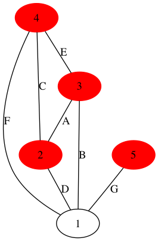
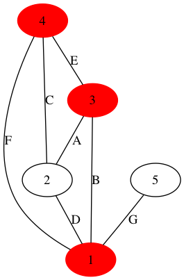

[Jananese](README_ja.md)/ English

# Visualization of Minimal Hitting Sets

## Summary

It makes a vertex cover (hitting set) problem, and visualizes its answer.

## Usage

    $ ruby mhs_ruby.rb size seed

- `size`: Size of problem. Default 5.
- `seed`: Seed for random number. Default is -1 (does not use seed).

## Results

It generates the input condition with table format of markdown and minimal hitting set of them. It also provides graph representations of them in PNG format.

    $ ruby mhs_ruby.rb 5 2

    Input Condition
    | | A | B | C | D | E | F | G |
    |-|:-:|:-:|:-:|:-:|:-:|:-:|:-:|
    |1| - | O | - | O | - | O | O |
    |2| O | - | O | O | - | - | - |
    |3| O | O | - | - | O | - | - |
    |4| - | - | O | - | O | O | - |
    |5| - | - | - | - | - | - | O |

    Minimal Hitting Sets
    4,2,1
    3,2,1
    5,4,3,2
    4,3,1

    Saved as input.dat
    Saved as input.bit
    Saved as mhs.dat
    Saved as mhs.bit
    Saved as graph.png
    Saved as graph_mhs0.png
    Saved as graph_mhs1.png
    Saved as graph_mhs2.png
    Saved as graph_mhs3.png

## Some details

Suppose you want to open a pizza shop with delivery service at some city. The city consists of some area, and you want to cover all of them. You have a list of candidates of employee. Possible delivery area is specified for each candidate. Whom you should hire in order to cover all area? This is a kind of hitting set problems (or vertex cover problems).

Here is an example.

| | A | B | C | D | E | F | G |
|-|:-:|:-:|:-:|:-:|:-:|:-:|:-:|
|1| - | O | - | O | - | O | O |
|2| O | - | O | O | - | - | - |
|3| O | O | - | - | O | - | - |
|4| - | - | O | - | O | O | - |
|5| - | - | - | - | - | - | O |

There are seven area and five candidates. The candidate-1 can cover B, D, F, and G, while the candidate-5 can cover only G.

The script enumerates the minimal hitting set of the above.

    Minimal Hitting Sets
    4,2,1
    3,2,1
    5,4,3,2
    4,3,1

For example, candidates 1, 2, and 4 can cover all area.

If you consider candidates to be vertices and area to be edges, then the above table can be visualazed as a graph as follows.

The minimal hitting set can be visualazed by coloring the chosen vertices (candidates) as follows.

* 4,2,1

* 3,2,1

* 5,4,3,2

* 4,3,1

## Other file formats

* `input.dat` speficies which area can be covered by whom. Rows are area.
* `input.bit` Bit array of the above.
* `mhs.dat` Minimal hitting sets.
* `mhs.bit` Bit array of the above.
