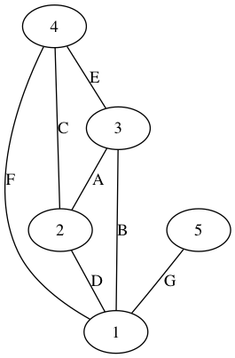
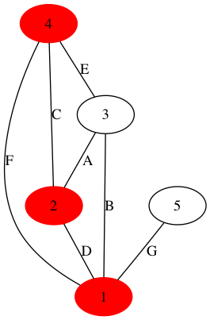
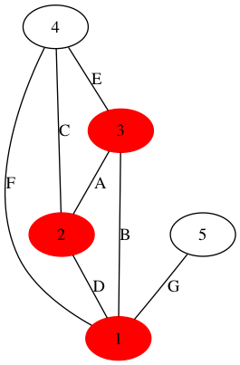
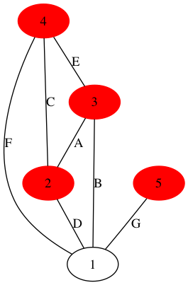
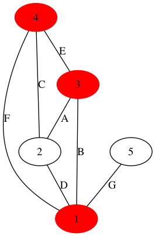

Japanese/ [English](README.md)

# 極小頂点被覆のグラフ化スクリプト

## 概要

頂点被覆問題を適当に作り、それを解いてグラフ化する。

## 使い方

    $ ruby mhs_ruby.rb size seed

- `size`: 問題のサイズ。デフォルトは5。
- `seed`: 乱数のシード。デフォルトは-1。

## 実行結果

実行すると、入力条件をMarkdownのテーブル形式で出力した後、極小頂点被覆を列挙する。また、そのグラフ表現をpngで保存する。

    $ ruby mhs_ruby.rb 5 2

    Input Condition
    |   | A | B | C | D | E | F | G |
    |---|---|---|---|---|---|---|---|
    | 1 | - | O | - | O | - | O | O |
    | 2 | O | - | O | O | - | - | - |
    | 3 | O | O | - | - | O | - | - |
    | 4 | - | - | O | - | O | O | - |
    | 5 | - | - | - | - | - | - | O |

    Minimal Hitting Sets
    4,2,1
    3,2,1
    5,4,3,2
    4,3,1

    Saved as input.dat
    Saved as input.bit
    Saved as mhs.dat
    Saved as mhs.bit
    Saved as graph.png
    Saved as graph_mhs0.png
    Saved as graph_mhs1.png
    Saved as graph_mhs2.png
    Saved as graph_mhs3.png

## 解説

例えばあなたがある地域のピザのデリバリーサービスを開業したいとする。その地域はいくつかのエリアにわかれており、配達ではその全てをカバーしたい。従業員の候補者は、配達可能なエリアが決まっており、なるべく少ない従業員数で開業するには誰と誰を雇えば良いだろうか？これが**最小**頂点被覆問題(Minimum Hitting Set Problem)である。

以下がサンプル。

|   | A | B | C | D | E | F | G |
|---|---|---|---|---|---|---|---|
| 1 | - | O | - | O | - | O | O |
| 2 | O | - | O | O | - | - | - |
| 3 | O | O | - | - | O | - | - |
| 4 | - | - | O | - | O | O | - |
| 5 | - | - | - | - | - | - | O |

この表では、配達すべき7つのエリア(A-G)と、5人の従業員候補者(1-5)について、誰がどこを配達可能かが記載してある。1番目の候補者はB,D,F,Gの4エリアについて配達可能だが、5番目の候補者はエリアGのみ配達可能、といった具合。

上記について、スクリプトは以下の候補を出力する。

    Minimal Hitting Sets
    4,2,1
    3,2,1
    5,4,3,2
    4,3,1

これは、例えば「1,2,4」の3名を雇えば全エリアをカバーできますよ、というもの。ここで列挙しているのは**極小**頂点被覆(Minimal Hitting Set, MHS)である。どの要素を除いても頂点被覆でなくなる、というのが極小頂点被覆の定義であり、最小頂点被覆は、極小頂点被覆のうち最も要素数が少ないもののことである。

さて、サンプルの表をよく見ると、各エリアを担当可能な人は二人ずついるので、候補者を頂点(Vertex)とし、エリアを候補者をつなぐ辺(Edge)としてグラフ表現ができる。そうして作ったグラフは`graph.png`として保存される。

頂点に候補者を、辺にエリア名を記載してある。我々は全エリアをカバーしたいのであるから、全ての辺が選ばれた頂点に接しているという条件で、なるべく少ない頂点を選びなさい、という問題になる。これが頂点被覆問題(Vertex Cover Problem)と呼ばれる所以である。この問題は、辺(Edge)が2つ以上の頂点を結ぶ場合に拡張され、そのようなグラフをハイバーグラフ、ハイパーグラフ上での頂点被覆はヒッティングセット(Hitting Set)と呼ばれることが多いので、ここでもヒッティングセット問題と呼ぶことにする。

さて、先の極小頂点被覆は4種類あったが、それぞれ選ばれた頂点に色をつけることで可視化できる。それらが`graph_mhs0.png`,`graph_mhs1.png`,...として出力される。

* 4,2,1

* 3,2,1

* 5,4,3,2

* 4,3,1

## その他の出力ファイル

入力に使った条件をテキストファイルで保存している。

* `input.dat` 各エリアを、誰が担当可能かを表したデータ。表とは90度傾いており、行がエリアになっている。
* `input.bit` 上記をビット表現にしたもの。最上位ビットは左側。
* `mhs.dat` 極小頂点被覆。つまり誰を雇えば全エリアをカバーできるかのリスト。
* `mhs.bit` 上記のビット表現
